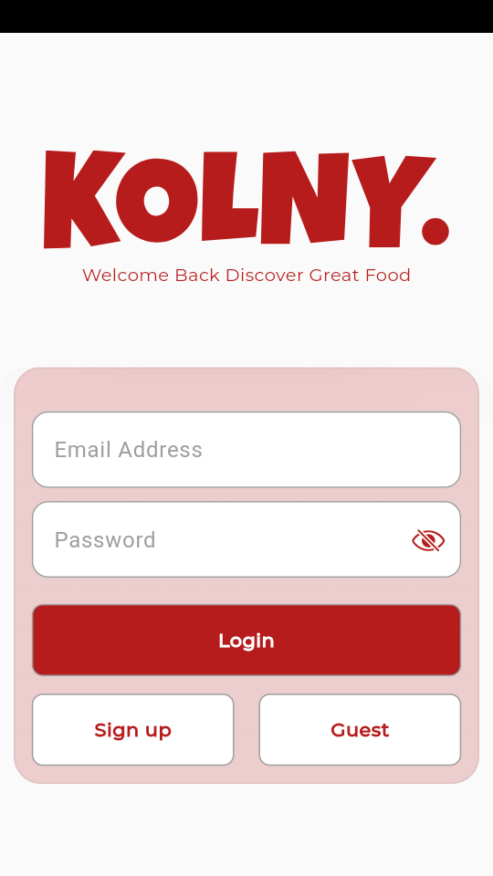
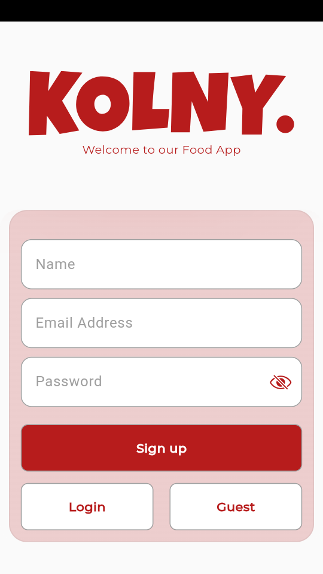
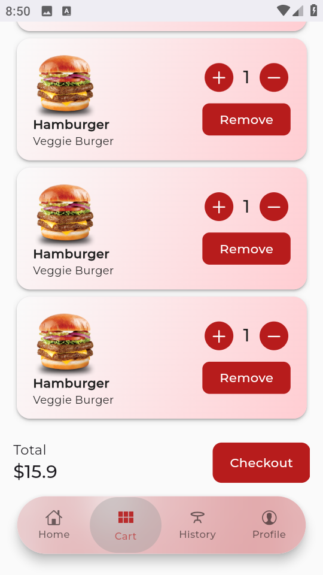
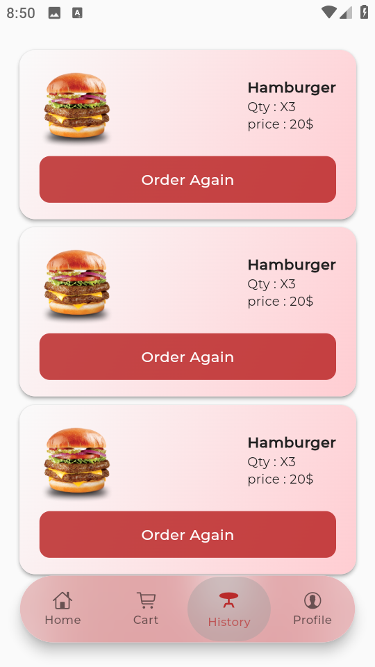
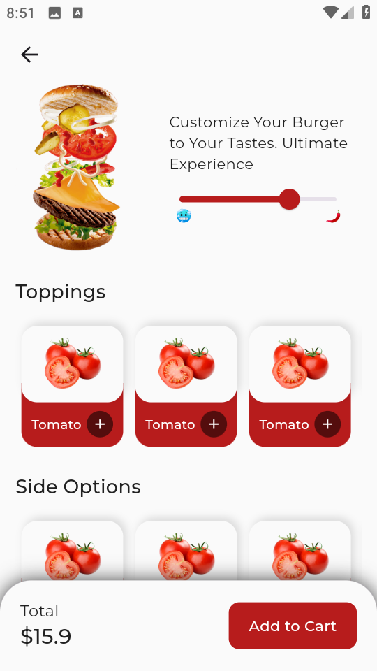
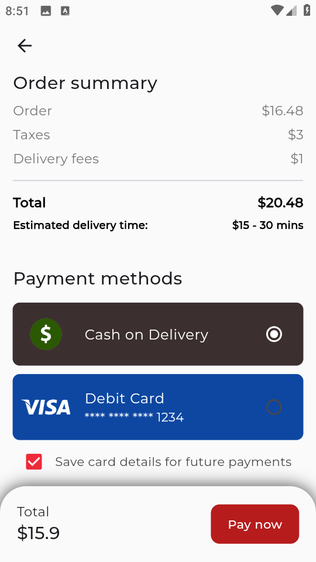
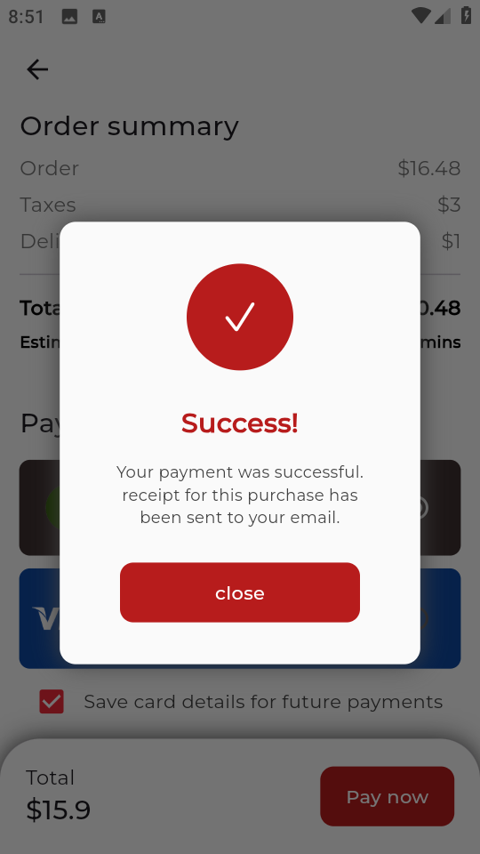

# 🍔 Hungry App

A Flutter application for food ordering and user profile management.  
This app allows users to register, log in, update their profile, upload/remove their photo, and manage their delivery address.

---

## 🚀 Features
- 🔐 User authentication (Login / Register / Logout)
- 👤 Profile management (Update info, change/remove profile picture)
- 🌐 API integration with backend (Django / Laravel)
- 📱 Responsive UI using `MediaQuery`
- 🎨 Modern and clean design
- ⚠️ Error handling with custom snackbars

---

## 🛠️ Tech Stack
**Frontend:** Flutter (Dart)  
**Backend:** Django / Laravel (REST API)  
**Image Handling:** ImagePicker  
**Networking:** Dio  

---

## 📱 App Screenshots

### 🧭 Auth Screens

| Splash | Login |
|:------:|:------:|
|  |  | 
 | 

---

### 🍕 Main Screens

| Home | Cart | Order | Profile |
|:--------:|:--------:|:--------:| :--------:|
|  |  | 
 |  | 

---

### 🛒 Checkout Flow

| ProductDetails | Checkout | Order |
|:--------:|:--------:|:--------:|
|  |  | 
 |

